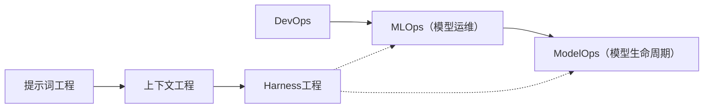

# 执行摘要

**Harness 工程**（Harness Engineering）是 AI/ML 时代兴起的一门新兴学科，它关注设计与实现支持 AI 智能体可靠运行的环境和机制。与传统的提示词工程、上下文工程不同，Harness 工程不仅优化一次性交互或上下文信息的输入，还构建约束、反馈、监测、文档等全生命周期的“缰绳和鞍具”，以确保智能体输出质量和系统可控性【50†L24-L30】【62†L115-L120】。当前多数来源将其定义为“围绕 AI Agent 构建的完整系统，包含各种约束、工具链和反馈回路，以让 AI 在人类设定的边界内可靠地工作”【34†L72-L74】【62†L115-L120】。为了支撑这一目标，Harness 工程涵盖了数据管理、模型训练、评估验证、部署监控、可解释性、安全合规、自动化编排、成本管理、可复现性、测试框架、工具链集成等多个维度。在实践中，OpenAI、Anthropic、LangChain 等公司都通过系统架构约束（如分层依赖、linter 校验）、文档驱动的 AGENTS.md、自动反馈循环（如失败自动修复）等方式，实现了大规模智能体开发。例如，OpenAI 三人团队在五个月内通过 Codex 生成了 100 万行代码的内部产品，关键在于精心设计的 Harness 环境，而非模型本身的能力【34†L59-L62】【56†L99-L106】。但Harness 工程仍面临诸多挑战，包括技术上的可解释性、上下文窗口限制、模型不可预测性，组织上的角色转变、技能缺口，以及法规合规、安全等问题。本文综合学术、行业与公司博客资料，深入分析了Harness工程的定义、核心组成（包括各维度的功能与实现方式）、代表性工具与框架（见下表）、与MLOps/Prompt Engineering/ModelOps等领域的异同（对照表及关系图）、典型实践案例（至少三家公司或开源项目）、当前挑战与最佳实践，以及未来研究方向等内容。所有观点均基于最新资料，并在可能处附图（Mermaid流程图、架构示意图）和参考文献，确保报告完整详实、技术准确。

## 一、Harness 工程的定义

“**Harness 工程**”是指构建支持和控制 AI 智能体（Agent）运行的基础设施与流程的工程实践。不同来源对其定义略有差异但核心一致：

- **中文来源**：腾讯云云+社区摘录指出，Harness 工程是一套“围绕 AI Agent 构建的约束、反馈与控制系统，使 Agent 在设定的边界内自主、可靠、可持续地工作”【2†L60-L67】。金钱豹团队文章定义：“Harness 工程即“驾驭工程”，指围绕 AI Agent 构建约束机制、反馈回路和持续改进循环的系统工程实践——核心在于确保生成能力强大的 Agent 输出可靠、一致、可维护”【34†L72-L74】。另一篇中文综述强调：Harness 工程关注整个系统层面：“Agent 运行在什么环境里，环境有哪些约束与反馈，当 Agent 出错时如何自动纠正”等【34†L85-L92】。这些定义都将 Harness 工程比作给脱缰野马套缰绳和马鞍，用以引导强大却易失控的模型能力【34†L69-L74】【62†L103-L105】。
- **英文来源**：OpenAI 报告中首次提出 Harness 工程概念，描述为使用 Codex 等智能体进行大规模软件开发时采用的“完整系统，包括架构约束、工具、反馈循环和文档等，可让 AI 按照人类意图可靠工作”【25†L310-L317】【12†L55-L63】。LangChain 博客指出：“Harness 工程的目标是塑造模型的智能能力——通过在模型周围构建系统性工具来优化性能、令其按预期高效运行”【50†L26-L30】。开发者社区一致认为，Harness 包括“任何让智能体产出可控可靠的机制”，比如上下文控制、权限管理、自我修正循环、可观测性等【12†L55-L63】【59†L189-L197】。一些学者与博文将其视为继提示词工程、上下文工程之后的更高层范式【34†L75-L84】【62†L115-L120】，涵盖从启动智能体到最终部署的全周期【62†L115-L120】。

**定义差异**：总体而言，各来源对 Harness 工程的描述较为一致，但侧重点有所不同。学术预印本尚处于起步阶段，尚缺乏同行评审定义。行业和博客则相辅相成：OpenAI 视其为 Codex 原生框架的描述【25†L310-L317】；LangChain 强调“构建系统工具链”【50†L26-L30】；开发者文章和白皮书（如 Martin Fowler 评论）则进一步强调“环境设计与反馈”与“模型行为监控”的区别【34†L85-L92】【62†L115-L120】。总体看，Harness 工程被公认为在 AI Agent 产品化中**重要新层次**：工程师角色从代码编写者转变为系统驾驭者，将人类经验“写入”系统，让概率性智能体可靠运行【34†L107-L116】【59†L216-L223】。

## 二、核心组成与维度

Harness 工程的核心构成涉及多个维度，涵盖整个 AI/ML 项目生命周期。主要包括以下方面（下文表格列举常见工具）：

- **数据与知识管理**：为智能体提供有效上下文和记忆，包括知识库、文档、长期/短期记忆系统等。实现方式如：检索-增强生成（RAG）方案、嵌入向量数据库（如 Faiss、Pinecone）和增强记忆模块（如 LangChain 的 Memory）。典型工具：LlamaIndex、Haystack、Weaviate 等，用于构建语义搜索和知识管理【12†L105-L113】【37†L134-L143】。
- **模型训练与更新流水线**：虽然 Harness 工程主要关注模型应用阶段，但在中大型项目中仍可能包含微调或增量学习。实现方式包括：持续集成的训练管道（如使用Kubeflow、MLflow、Airflow等），用于监测模型性能并触发再训练。代表性工具：Kubeflow Pipelines（CI/CD 工作流）、MLflow（实验追踪）、DVC（数据版本控制）等。
- **评估与验证**：自动化测试和验证是 Harness 的关键，确保 AI 输出质量。包括：单元测试、端到端测试、自动化评估（使用基准数据集或人类反馈）、自我验证循环等。常见实践：利用 OpenAI Evals 或自定义验证代理（如 LangSmith），对 Agent 输出进行批量评测。工具：LangSmith（LangChain 提供的评估平台）、OpenAI Evals、GitHub Actions 等自动化测试框架。
- **部署与监控**：将训练好的模型和代理系统部署到生产环境，并对其运行状况进行监控。实现方式包括：容器化部署（Docker/Kubernetes）、实时监控和日志收集（Prometheus、Grafana、LangSmith 可视化），以及异常检测告警机制。代表性工具：Kubeflow Serving、Prometheus（指标采集）、Grafana（监控大盘）、LangSmith（对话与成本指标监控）【59†L175-L184】【50†L53-L61】。
- **可解释性与日志记录**：记录和展示 AI 决策过程，提高透明度。包括：对话日志、错误追踪、决策路径可视化等。常用工具：LangSmith 存储每次 Agent 行动与工具调用，用于事后分析【50†L32-L41】；开源框架如 LangGraph 可插入钩子追踪 Agent 状态。
- **安全与合规**：定义权限与审计机制，防止滥用。实现方式如：输入输出过滤（例如安全代理、内容检查工具）、权限沙箱（OpenAI 助手 API 提供的沙箱执行）、审计记录。代表性工具：OpenAI Assistants API（内置权限模型）、Claude Agent SDK（集成权限与 Hook）、TrustFall 等安全代理库。
- **自动化与编排**：管理多步骤、多 Agent 协作。实现方式：工作流引擎（如 Apache Airflow、Prefect、AWS Step Functions）、多 Agent 协同框架。工具：LangGraph（图式多步编排）、CrewAI Flows（多 Agent 事件驱动流水线）【40†L300-L308】、AutoGen（AutoGPT 类框架）。
- **成本与资源管理**：对调用大模型或 Agent 的成本进行优化。措施包括：选择合适模型、动态调整温度/步数、并发控制、批处理请求、监控成本（LangSmith 提供令牌计数和费用记录）【50†L53-L61】。工具：Vibe.CostCalculator（示例成本估算）、云监控服务（如 AWS Cost Explorer）。
- **可复现性**：保证环境和结果可重现。包括：容器化环境、版本控制（代码、上下文文档、模型版本）、完整流水线定义。工具：Docker、Git/GitHub、MLflow、Metaflow 等。
- **测试框架**：用于验证完整 Agent 系统。包括：模拟环境（如 Gimli、AutoTest Agent），行为驱动测试（BDD）和传统测试工具（pytest、unittest 集成 Agent 调用）。示例：TerminalBench 基准测试用于代码代理【50†L18-L26】；OpenAI 内部使用 CI 以项目特有方式自动运行测试【37†L145-L153】【50†L39-L41】。
- **工具链集成**：将 Agent 的输入输出与开发工具链结合，如 IDE 插件、脚本接口、CI/CD 集成等。代表工具：Cursor（在 IDE 中集成规则与提示【40†L315-L317】）、GitHub Actions、CI 平台、IDE 扩展等。

### 代表性工具对照表

| 工具/框架                | 功能与特点                                              | 典型场景                                    | 链接                                 |
|-------------------------|-------------------------------------------------------|------------------------------------------|--------------------------------------|
| **OpenAI Codex/Assistants API** | 官方提供的智能体平台，支持工具定义、文件权限控制、沙箱执行。Codex 内置基于 `AGENTS.md` 的配置与 CI 集成验证【25†L310-L317】【40†L295-L303】。 | 大规模自动化代码生成、自动 CI 校验                         | [OpenAI 文档](https://platform.openai.com/docs/agents) |
| **LangChain**           | AI Agent 框架，支持构建自定义多步代理系统。提供 Prompt/Context 管理、内存、工具调用等模块【40†L300-L308】【50†L26-L30】。 | 快速原型智能体与 Vibe Coding，构建编码或对话代理               | [LangChain 文档](https://docs.langchain.com) |
| **LangSmith**           | LangChain 的观测与评估平台，记录 Agent 交互、统计成本、评测输出。支持搜索异常会话、分布式运行指标收集【50†L53-L61】。 | 对训练/生产智能体进行性能分析和日志追踪                         | [LangSmith](https://smith.langchain.com) |
| **LangGraph**           | 状态化图式编排框架。支持在多步骤智能体工作流中进行有向图式编排，管理状态持久化、错误恢复和回滚【40†L300-L308】。 | 需要并行多 Agent 协作、长期任务执行的场景，如研发助理流水线         | [LangGraph Blog](https://blog.langchain.com/langgraph) |
| **CrewAI Flows**        | 多智能体协作框架，提供事件驱动流水线。可构建研究-编写-复审等角色的代理协同流程【40†L305-L308】。 | 企业级多角色协作任务，如报告撰写、审核流程                         | [CrewAI 官网](https://crewai.com) |
| **Claude Agent SDK**    | Anthropic 提供的智能体 SDK，内置权限模型与 Hook 系统，支持多会话长时运行；跨会话上下文桥接技术（参考 Anthropic 长时代理研究）【40†L309-L313】。 | 在 Claude Code 平台开发复杂、长任务智能体                         | [Anthropic 文档](https://docs.anthropic.com/claude-code) |
| **Cursor IDE**          | 集成 IDE 插件，内置规则文件、循环检测和模型适应功能，将 Harness 逻辑紧密结合开发环境【40†L315-L317】。 | 开发者在 VSCode/JetBrains 中使用智能助理写代码                     | [Cursor 官网](https://cursor.so) |
| **MLflow/DVC**          | 用于数据和模型版本管理、实验跟踪的工具。确保数据集和模型可版本化、可复现。        | 机器学习流水线管理、多模型迭代                               | [MLflow](https://mlflow.org)、[DVC](https://dvc.org) |
| **Kubeflow/Argo/Airflow** | 常见工作流引擎，支持容器化部署与复杂任务编排，配合 Kubernetes 实现大规模调度。  | 需要流水线自动化和容器化部署的 AI 服务                         | [Kubeflow](https://www.kubeflow.org)、[Airflow](https://airflow.apache.org) |
| **OpenAI Evals**        | 自动评测框架，用于批量评估 LLM/Agent 输出，计算准确率、覆盖率等指标。      | 智能体生成结果的自动化测试和打分                               | [OpenAI Evals](https://github.com/openai/evals) |
| **Prometheus/Grafana**  | 监控与可视化堆栈，收集运行指标（延迟、错误率、资源利用等）。                | 实时监控部署的智能体服务性能与健康状态                           | [Prometheus](https://prometheus.io)、[Grafana](https://grafana.com) |
| **其他工具**            | 包括 LlamaIndex（知识检索）、Vault（机密管理）、FastAPI（API 网关）、CI/CD（Jenkins/GitHub Actions）等 | 各类辅助工具，如构建知识库、保护凭据、暴露服务、集成测试流程      | — |

## 三、与相关领域的比较

Harness 工程与**MLOps**、**Prompt Engineering**、**ModelOps** 等领域既有交集又有区别。下表对比了它们的关注点和职责：

| 领域            | 主要关注            | 范畴                           | 核心目标                                    |
|---------------|------------------|------------------------------|-------------------------------------------|
| 提示词工程 (Prompt Engineering) | 单次交互的提示优化       | 单条指令和对话                    | 设计高效 prompt 以提升模型单次输出质量                |
| 上下文工程 (Context Engineering)  | 上下文信息构建和管理      | 单次任务的输入上下文                 | 管理和传递必要信息（文档、知识库、历史记录等）给模型    |
| Harness 工程      | 智能体运行环境与约束     | 整个智能体系统全生命周期              | 构建设备约束、监控和反馈回路，让AI Agent在生产环境中可靠工作 |
| MLOps         | 模型训练与运维        | 模型从训练到部署的生命周期           | 自动化训练、部署、监控和管理机器学习模型                 |
| ModelOps      | 模型管理与治理        | 模型的持续交付和运营               | 确保模型符合业务标准、安全合规、跨平台持续可用             |

如上所示：Prompt 工程和上下文工程主要集中在**单次任务/对话**的输入层面，而 Harness 工程则是**系统级**：设计 AI 运行环境、执行反馈和纠正机制【34†L85-L92】【62†L115-L120】。与 MLOps/ModelOps 相比，后者聚焦于模型研发流程、部署管道和治理，而 Harness 则是专门针对使用模型阶段的可控性设计——两者可以协同：MLOps 解决模型本身生命周期问题，Harness 负责确保模型在应用中“按规则行事”。下图用 Mermaid 流程图示意了各领域的关系与重叠：

这里：提示词工程推进上下文工程，再进一步归入 Harness 工程的系统层。MLOps/ModelOps 处于 DevOps 下游，主要处理模型的训练、部署与治理；Harness 工程与它们有交集（例如模型部署后需要监控与反馈），但核心在于构建**AI 产出的完整控制体系**【59†L165-L174】【25†L283-L288】。

## 四、行业实践案例

以下选取三个不同公司/项目的实例，说明它们如何实现 Harness 工程、采用的工具链、遇到的挑战与解决方案。

### 1. **OpenAI Codex 内部实验**

- **背景**：2026 年 OpenAI 报告描述，3 名工程师用 Codex（基于 GPT-4 训练的代码模型）在 5 个月内构建了一个百万行代码的产品【34†L59-L62】。实验中没有一行代码由人工编写，效率据称是传统方式的十倍。
- **Harness 组织**：团队聚焦于构建严密的环境约束：分层架构**（Architecture as Guardrails）**【56†L133-L139】，明确代码各层次依赖方向；并将这些规则**“代码化”**，通过 Codex 自动生成 linter，在 CI 中机械执行【37†L149-L157】。此外编写大量 AGENTS.md 文档，将架构决策、构建/测试步骤等规范化【59†L199-L207】。团队还通过与浏览器 DevTools 协同，使 Agent 可以“看见”应用界面并通过截图验证 UI（即可观测性）【37†L91-L94】。
- **工具链**：采用 OpenAI 提供的 Agents API 和 Codex，结合 GitHub Actions（CI）、自研验证工具。团队使用 Harbor 框架来调度测试，每个动作日志都存储于 LangSmith，以便分析失败模式【50†L45-L54】。具体技术如：限制 `service` 层依赖 `controller` 层的方向，通过 linter 自动阻止违规提交【37†L149-L157】；预置系统提示（System Prompt）引导 Codex 按模块执行；错误后提示工具**自我修正**【37†L149-L157】。
- **挑战与解决**：一大挑战是让 AI 自动化生成的代码符合架构规范和测试标准。解决方案是**自动化反馈闭环**：CI 失败后自动生成修复 PR，错误信息同时作为下一次 Agent 的上下文反馈，Agent 自主尝试修复【37†L149-L157】。通过这一机制，90% 的 CI 故障能由 Agent 自动修复。最终，Harness 的存在使团队不再依赖逐行审查，而依赖系统的可执行规则【37†L149-L157】【59†L189-L197】。

【15†embed_image】图：OpenAI 将 AI 代理连接至 Chrome DevTools 协议（图示中为 Codex 驱动的应用程序），通过截图自动验证用户界面，实现对 Agent 执行结果的可观察性【37†L91-L94】。Harness 中的可观测性层面让 Agent 在执行任务时能“自我检查”，提高了输出的可靠性。

### 2. **Anthropic Claude Code 项目**

- **背景**：Anthropic 推出的 Claude Code 平台可看作针对大型代码生成任务的专业智能体工具。其设计融合了允许长时间会话运行的技术，如 **状态持久化**、多轮会话上下文桥接等【40†L309-L313】。
- **Harness 组织**：Anthropic 强调权限与反馈。Claude Agent SDK 内置权限管理，可限制智能体访问系统的文件/网络资源【40†L309-L313】。他们使用类似于 OpenAI 的代码化约束：将编码规范、依赖规则等转化为可执行检查。另一个关键是针对长时任务的“初始化器（initializer）”设计：每个新会话开始时，将上次未完成工作转换为结构化的进度文件（如 JSON），帮助 Agent 快速理解之前的状态【59†L231-L239】。
- **工具链**：Claude Code 提供专用 IDE 插件和版本控制接口，保证智能体工作在与人类开发者**相同环境**中【59†L167-L175】。AGENTS.md（或其替代）被用作“项目说明文件”，Anthropic 特别建议以 JSON 格式记录任务进度，避免 Agent 无意中篡改规范【59†L231-L239】。他们还部署了后台“回收 Agent”，持续扫描并修复过时文档和架构漂移【37†L163-L170】。
- **挑战与解决**：长时任务中，一个难点是“每次会话 Agent 都从头开始”的问题。通过**持久化状态**与“接力棒”式进度文件，将多个会话串联起来，解决了此问题【59†L231-L239】。另一个挑战是权限边界：Anthropic 通过内置的 Hook 机制和权限模型，限制 Agent 对系统资源的随意调用，并在调用成功后检查结果。

### 3. **LangChain DeepAgents 和 LangSmith 示例**

- **背景**：LangChain 团队发表了一个案例，使用其开源 DeepAgents 库和 LangSmith 平台，构建并提升了一个代码生成智能体。最初在 TerminalBench 2.0 基准测试中，该 Agent 得分 52.8%，在排行榜靠前 30 名左右【50†L24-L30】。
- **Harness 组织**：团队将问题归结为 Harness 设计。他们添加了一系列“开关”来调整环境：改进系统提示（比如明确任务解决步骤）、优化工具集（如为每个环节添加检查工具）、引入中间件（Middleware）钩子，例如**预完成检查**功能，强制 Agent 在结束前进行自我测试【50†L39-L41】【50†L60-L68】。同时，他们构建了自动化的 **“追踪分析”（Trace Analysis）技能**：在每次实验后收集 Agent 日志，启动平行的辅助 Agent 来分析失败原因，并给出改进建议。这样形成持续迭代的反馈环【50†L39-L41】【50†L70-L79】。
- **工具链**：使用 DeepAgents 库实现智能体循环（包括任务分解、多代理协作等），并通过 LangSmith 跟踪每次行动、耗时和成本【50†L53-L61】。Harbor 框架用于批量运行基准任务并进行评分【50†L45-L54】。他们利用 LangGraph 和 Pandas 等构建可分析的 Trace 数据结构，再通过 Agent Skills 进行自动解析。
- **效果与难点**：仅修改 Harness 设计，LangChain 团队的 Agent 分数从 52.8% 提升至 66.5%，名次跃升至前 5【50†L18-L26】【48†L69-L78】。核心提升在于增加了**自我验证循环**：Agent 在写完代码后主动运行测试并根据反馈修复问题【50†L99-L107】，以及向 Agent 提供更多环境信息（目录结构、超时时间、工具位置等）【50†L130-L139】。主要挑战是如何让 Agent 真正执行测试步骤，于是他们在系统提示中加入执行测试的指导，并使用 PreCompletionChecklistMiddleware 强制 Agent 最后一次确认已完成测试【50†L99-L107】【50†L120-L128】。这些改进显著提升了质量。

【19†embed_image】图：基于 LangGraph 的示例智能体系统架构，展示了输入校验（guardrail）、代理执行、工具调用、中断处理、持久化存储和可观察性组件等环节【40†L300-L308】【50†L24-L30】。图中各元素对应构建稳定工作流的必要部分，如状态持久化（例如 pgvector）、指标收集（Grafana）、以及分布式错误处理。

## 五、当前挑战、风险与最佳实践

### 挑战与风险

- **技术层面**：LLM 智能体仍存在不可预测性、Hallucination（输出错误）等问题；上下文窗口受限，超长任务需分段规划；难以对智能体决策提供可解释性；多智能体协作复杂度高。没有良好Harness的系统容易出现“中断后重新开始丢失上下文”或“生成垃圾代码”等问题【35†L52-L60】【62†L103-L105】。InfoWorld 报道指出，盲目以 AI 取代工程师会导致系统**脆弱**、云资源成本**失控**、项目需重构【53†L195-L201】。例如亚马逊 2026 年 3 月的案例中，AI 工具生成的代码导致订单中断，反映出真实环境中的风险【52†L77-L83】。
- **组织层面**：工程师需从传统写代码角色转型，习得 Harness 设计能力，目前在团队中存在技能缺口；管理和沟通模式要向“系统设计+流程监督”转变【34†L107-L116】【59†L277-L284】；缺少成熟的团队协作标准和人员配备（如未专门指定 Agent 管理者）。文化上，需要克服对 AI 代码的不信任，以及对速度与质量间平衡的误区（“Agent 产出太快容易放松审查”陷阱）【59†L277-L284】。
- **法规合规与安全**：使用外部或开源模型涉及数据隐私和知识产权风险；AI 生成内容的归属和审计需法律框架；对关键行业（金融、医疗等）而言，合规性要求更加严格。缺少行业标准和审计工具，使得落实“人类对策”与事故追责成为难题。此外，AI 系统可能被恶意利用，对安全边界提出挑战。
- **可靠性与可用性**：生产级 AI 系统对高可用性要求高，一旦 Agent 出错可能造成服务中断。因 Agent 的高度自动化，错误传播风险增加，需要完善的监控与回退机制。OpenAI 报告强调：Harness 工程的核心正是“让模型工作可靠到可以信任”【40†L352-L361】；若实施不到位，则系统稳定性无法保障。

### 最佳实践与改进建议

- **约束架构**：构建**分层模块化架构**，明确每层职责和依赖方向【56†L133-L139】【37†L149-L157】。通过代码化规则（linter、结构化测试等）在编译/CI 阶段强制实施边界【37†L149-L157】【59†L189-L197】。最佳实践为将过去“人脑经验”写进自动检查工具，如 OpenAI 采用的 **修复型 lint**：错误报告直接告知 Agent 如何改正【59†L189-L197】。
- **文档驱动**：维护常更新的**AGENTS.md**（或 CLAUDE.md 等）作为智能体的“使用说明书”。确保每次 Agent 错误时都更新文档【59†L216-L223】。文档应包含：构建/测试命令、代码规范、常见陷阱等【59†L199-L207】。实践证明，这不仅为 Agent 提供第一手上下文，也形成了错误-修正的循环【59†L199-L207】【59†L216-L223】。
- **自动反馈循环**：集成自动化的自我验证机制。例如让 Agent **自我测试并修复**【50†L99-L107】；构建跟踪分析 Agent，批量分析错误并给出调整建议【50†L70-L79】；定期运行“清洁 Agent”清理技术债【37†L163-L170】。Lens Gong 建议：“任何发现 Agent 犯错的情况，都要花时间工程化一个解决方案，确保该错误不再复现”【59†L216-L223】。这要求团队投入时间改进流程，而非手动补救。
- **监控与可视化**：部署综合监控体系，跟踪关键指标（成功率、失败场景、资源消耗）并及时报警。利用 LangSmith 等工具记录全部 Agent 行动【50†L53-L61】。在仪表盘展示环境健康度，以及 Agent 执行的“血缘”（trace），帮助快速定位故障。【59†L175-L184】【25†L283-L288】。
- **人机协作底线**：保持**人类复核**和审查作为底线。严格坚持“**拒绝水份**”原则：保证每次合并都有人审核，不能因为 Agent 自动化而降低标准【59†L277-L284】。负责的代码审查者应对 Agent 产物承担与人工代码同等的责任【59†L277-L284】。这能有效减少低质量代码进入主分支的风险。
- **规划先行**：在执行前充分规划。许多实践者强调将项目拆解为详细计划，审核并批准后再让 Agent 开始编码【59†L249-L258】。这样可避免 Agent 一次性输出半成品后无从下手。Anthropic 的方法是让初始化器先生成测试用例列表或功能表，再分步实现【59†L251-L259】。
- **持续迭代与学习**：建立团队日常流程，将 Harness 视作不断演进的产物。每个项目结束后复盘失败模式，并将经验固化为新的规则或文档。定期迭代工具链（如更新 Agent 可访问的新工具）以及调整 Agent 策略。保持敏捷心态，根据新技术或业务变化及时改进 Harness。

以上短期措施着重搭建可靠的开发流程和自动化机制；长期来看，可进一步研究更系统的标准和语言支持。比如制定行业通用的 AGENTS.md 标准模式、开发用于指定权限的 DSL、建立专业化的可解释性框架，以及制定法规以规范智能代理的使用。

## 六、未来研究方向与参考资料

**未来研究方向**：Harness 工程本质上仍是一个新兴领域，亟待系统化研究。可能的方向包括：构建形式化的 Harness 模型或评价基准；研究多智能体（Agent Fleet）协调策略；发展 Agent 可解释性理论；优化上下文管理技术（如智能存储压缩、主动过滤）；深入探讨代理安全合规（如在隐私数据处理中的审计方法）；以及AI与人类协作新范式（角色分工、培训流程）的社会技术问题。还可以探索将 MLOps 和 Harness 融合的工具链，例如将模型管理平台与 Agent 管理平台集成，使整个 AI 生命周期无缝衔接。

**参考资料**：以下列出按主题分类的关键参考，包括中文和双语资源。读者可根据需要深入阅读：
- **定义与概念**：《Harness Engineering 是什么？一场新的 AI 范式》【35†L66-L74】【62†L115-L120】（中文），OpenAI 官方报告【25†L310-L317】（英文）。
- **核心组成与工具**：《What Is Harness Engineering? Complete Guide》【12†L55-L63】【40†L295-L303】（英文），LangChain 博客【50†L26-L30】（英文）。
- **对比与原理**：《Harness Engineering 深度解读：AI Agent时代的缰绳与马鞍》（知乎，提供Prompt/Context/Harness对照）【34†L75-L84】【62†L115-L120】（中文），Ignorance.ai Playbook【56†L120-L129】【59†L165-L174】（英文）。
- **业界案例**：OpenAI Codex 报告【25†L254-L263】【37†L149-L157】（英文转摘中文），LangChain DeepAgents 案例【50†L18-L26】【50†L39-L47】（英文），Claude Code 技术文章【40†L309-L313】【59†L189-L197】（英文）。
- **挑战与实践**：InfoWorld “AI 编码宿醉”【53†L195-L201】【52†L77-L83】（英文）、Ignorance.ai 技术心得【59†L175-L184】【59†L189-L197】（英文）。
- **参考链接表**：有关工具、博客和论文的链接，可查阅上述每个引用条的具体来源，以及文末列表的超链接。

通过对现有资料的综合分析，我们提供了 Harness 工程的全面视角：从概念内涵到技术实现，从工具对比到案例研究，以及前沿问题和发展趋势的探讨，为工程背景的技术管理者或高级工程师提供细致而深入的参考。 Harness 工程代表了 AI 产业升级的关键一环：它让工程师从写代码的角色转变为构建可靠 AI 运行环境的角色，是实现可控、可持续 AI 价值的必经之路。

**参考文献：**

- Harness 工程概念：金钱豹【34†L72-L74】【34†L85-L92】、一碗面【35†L66-L74】【62†L115-L120】、OpenAI 报告【25†L310-L317】。
- 核心组成与工具：NXCode 指南【12†L55-L63】【40†L295-L303】、LangChain 博客【50†L26-L30】、CloudTencent 转译【2†L60-L67】【37†L149-L157】。
- 相关领域对比：Ignorance AI【56†L120-L129】【59†L165-L174】、GitCode 文章【62†L115-L120】【34†L75-L84】、InfoQ 摘要【25†L310-L317】。
- 实践案例：OpenAI 实验【37†L149-L157】【50†L18-L26】、LangChain 示例【50†L39-L47】、Anthropic 探讨【59†L189-L197】【59†L231-L239】。
- 挑战与最佳实践：InfoWorld【53†L195-L201】、Ignorance AI【59†L216-L223】【59†L251-L259】、OpenAI 博客【25†L283-L288】、LangChain 博客【50†L99-L107】。
- 未来方向与评论：Ignorance AI【56†L99-L106】【56†L120-L129】、Martin Fowler 评论【62†L109-L113】【56†L99-L106】等。